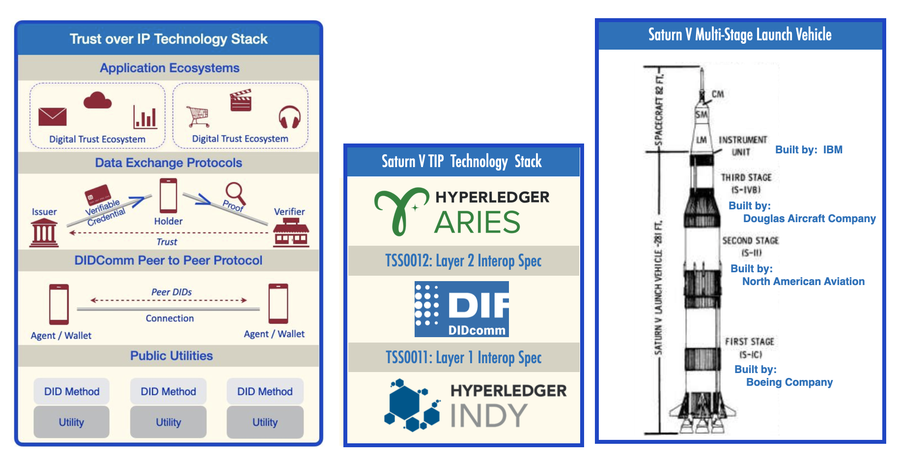

Today, the decentralized identity community continues the *moon shot* started by the *Sovrin Foundation* towards self-sovereign identity. This TIP represents a vertical interoperable stack that is already familiar to many of the industry participants who were working on the exchange of trusted data before the COVID Pandemic. This proposal is effectively receiving the baton that began with the [Sovrin Community](https://sovrin.org/) and will focus on evolving that effort into a network of networks model.

## Scope
While many of the vendors supporting this TIP have roots in the Sovrin Community, this collaborative effort **does not** have a dependency or affiliation with the [Sovrin Foundation](https://sovrin.org/). This endeavor strives to establish a ecosystem of interoperable vendors that support many of the lessons learned, designo principles and best practices from the Sovrin Community while opening the aperture to allow for integration with a variety of layer 1 public identity utilities.  

## Name
This TIP represents the next evolutionary step towards the *moon shot* known as decentralized identity. Acknowledging the [recently successful NASA/Space-X mission](https://www.cnet.com/news/spacex-splashdown-replay-see-nasa-astronauts-safely-return-to-earth-from-iss/) that has revitalized attention to space exploration, history reveals that our early success in space was significantly aided by the **Saturn V** multi-stage rocket platform.

The *Saturn V* three-stage rocket served as a *Heavy Lift Vehicle* for space exploration. It was the most powerful rocket that had ever flown successfully. The *Saturn V* was used in the Apollo program in the 1960s and 1970s. It also was used to launch the Skylab space station. Containing three (3) powerful fuel-stages, this massive rocket was used to propel man to the moon.

Since we are in the early stages of the technology adoption lifecycle for decentralized identity, we seek a technical architecture (**recipe**) to bootstrap an _interoperable digital trust marketplace_. Analogous to the first three layers of the ToIP Technology Stack, this TIP represents an exemplar of a technical collaboration to help propel decentralized identity into mainstream adoption.

In fact the *Saturn V* project required that three separate companies, each responsible for a separate fuel-stage, collaborated to integrate their fuel-engines into [a single interoperable rocket platform](https://www.space.com/18422-apollo-saturn-v-moon-rocket-nasa-infographic.html) that would propel the Appolo and Skylab missions. Today, we seek to integrate technology for three ToIP Layers to achieve a common goal -- **help propel the adoption of digital credentials**.
